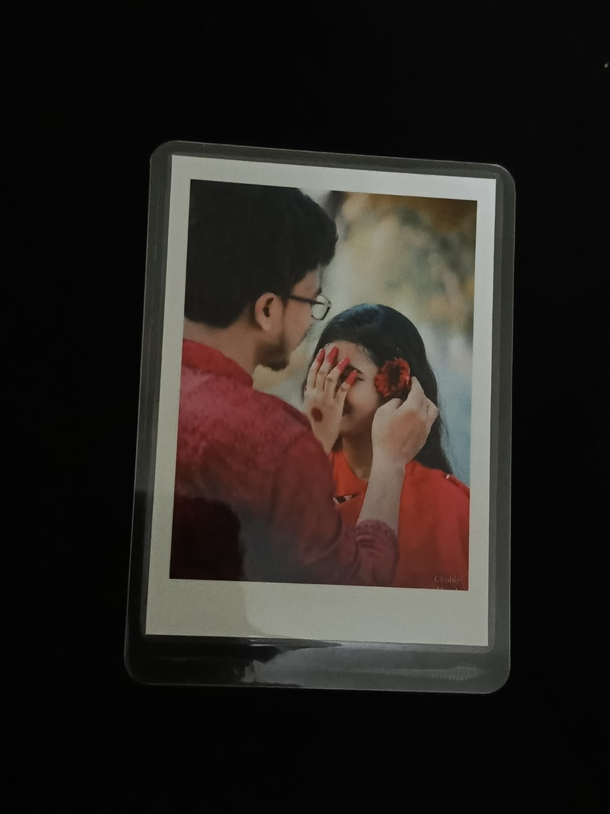

# Paraloid Photo Gallery Website 📸

A modern, responsive photo showcase website for professional photography business with integrated Facebook Messenger ordering.

## 🌟 Features

### Core Features

- ✅ **Modern Gallery Layout** - Clean, masonry-style grid with soft shadows
- ✅ **Category Filtering** - Filter photos by Nature, Portraits, Architecture, Street, Abstract
- ✅ **Lightbox Viewer** - Full-screen photo viewing with keyboard navigation
- ✅ **Messenger Integration** - Direct ordering via Facebook Messenger
- ✅ **Fully Responsive** - Optimized for mobile, tablet, and desktop
- ✅ **Smooth Animations** - Scroll animations and hover effects
- ✅ **SEO Optimized** - Proper meta tags and semantic HTML

### Pages

1. **Home Page** - Hero section + featured photos
2. **Gallery Page** - Complete collection with category filters
3. **About Page** - Business story and features
4. **Contact Page** - Multiple contact methods + FAQ

## 📁 Project Structure

```
paraloid-photo-gallery/
│
├── index.html              # Home page
├── gallery.html            # Gallery page with filters
├── about.html              # About page
├── contact.html            # Contact page
│
├── css/
│   └── styles.css          # Main stylesheet
│
├── js/
│   └── main.js             # JavaScript functionality
│
└── images/
    ├── photos/             # Product photos (photo1.jpg - photo12.jpg)
    ├── hero-bg.jpg         # Hero background image
    └── about-photo.jpg     # About page image
```

## 🚀 Quick Start

### 1. Setup Your Photos

Add your photos to the `images/photos/` folder:

- Name them: `photo1.jpg`, `photo2.jpg`, etc. (or update the HTML)
- Recommended size: 1200x900px (4:3 aspect ratio)
- Format: JPG or PNG
- Optimize images for web (compress to < 500KB each)

### 2. Configure Messenger Links

**IMPORTANT:** Replace all placeholder Messenger links with your actual Facebook Page ID.

Find and replace in **ALL HTML files**:

```html
<!-- Replace this: -->
https://m.me/YOUR_PAGE_ID

<!-- With your actual Messenger link: -->
https://m.me/your-actual-page-name-or-id
```

**How to find your Facebook Page ID:**

1. Go to your Facebook Business Page
2. Click "About" tab
3. Scroll to find "Page ID" or use the page username
4. Your Messenger link will be: `https://m.me/PAGE_USERNAME`

### 3. Update Social Media Links

Replace in all HTML files:

```html
<!-- Facebook -->
<a href="https://facebook.com/YOUR_PAGE" ...>
  <!-- Change to: -->
  <a href="https://facebook.com/your-page-name" ...>
    <!-- Instagram -->
    <a href="https://instagram.com/YOUR_HANDLE" ...>
      <!-- Change to: -->
      <a href="https://instagram.com/your-handle" ...></a></a></a
></a>
```

### 4. Customize Business Information

**Update in all pages:**

- Email: Change `info@paraloid.com` to your email
- Business name: Change "Paraloid" if needed
- Photo descriptions and prices
- About page content

### 5. Open the Website

Simply open `index.html` in your web browser:

- **Windows:** Double-click `index.html` or right-click → Open with → Browser
- **Mac:** Double-click or drag to browser
- **Local Server (recommended):**
  ```bash
  # If you have Python installed:
  python -m http.server 8000
  # Then open: http://localhost:8000
  ```

## 🎨 Customization Guide

### Colors

Edit in `css/styles.css` at the top (`:root` section):

```css
:root {
  --primary-color: #2c3e50; /* Dark blue-gray */
  --secondary-color: #3498db; /* Bright blue */
  --accent-color: #e74c3c; /* Red accent */
  /* Change these to your brand colors */
}
```

### Adding More Photos

1. **Add to Gallery Page** (`gallery.html`):

```html
<div class="photo-card" data-category="nature">
  <div class="photo-image">
    
    <div class="photo-overlay">
      <button
        class="view-btn"
        data-image="images/photos/photo13.jpg"
        aria-label="View full size"
      >
        <i class="fas fa-search-plus"></i>
      </button>
    </div>
  </div>
  <div class="photo-info">
    <span class="photo-category">Nature</span>
    <h3 class="photo-title">Your Photo Title</h3>
    <p class="photo-description">Your description here</p>
    <div class="photo-footer">
      <span class="photo-price">$45.00</span>
      <a
        href="https://m.me/YOUR_PAGE_ID"
        class="btn-order"
        target="_blank"
        rel="noopener"
      >
        <i class="fab fa-facebook-messenger"></i>
        Order on Messenger
      </a>
    </div>
  </div>
</div>
```

2. **Categories:** Use `data-category` values: `nature`, `portrait`, `architecture`, `street`, `abstract`

### Adding New Categories

1. Add filter button in `gallery.html`:

```html
<button class="filter-btn" data-filter="wedding">Weddings</button>
```

2. Add photos with matching category:

```html
<div class="photo-card" data-category="wedding"></div>
```

### Changing Prices

Search for `photo-price` in HTML files and update:

```html
<span class="photo-price">$45.00</span>
```

### Hero Section Background

Replace `images/hero-bg.jpg` with your own image (recommended: 1920x1080px)

## 📱 Responsive Breakpoints

- **Desktop:** 1200px+
- **Tablet:** 768px - 1199px
- **Mobile:** < 768px

The site automatically adjusts layout for all screen sizes.

## ⚡ Performance Tips

1. **Optimize Images:**

   - Use JPG for photos
   - Compress to 70-80% quality
   - Keep file size under 500KB
   - Tools: TinyPNG, ImageOptim

2. **Lazy Loading:**

   - Already implemented with `loading="lazy"` on images

3. **Minify Code (for production):**
   - Minify CSS and JS using online tools
   - Combine files to reduce requests

## 🔧 Browser Support

- ✅ Chrome (latest)
- ✅ Firefox (latest)
- ✅ Safari (latest)
- ✅ Edge (latest)
- ✅ Mobile browsers (iOS Safari, Chrome Mobile)

## 📦 Deployment Options

### Option 1: GitHub Pages (Free)

1. Create GitHub repository
2. Upload all files
3. Enable GitHub Pages in Settings
4. Access at: `https://yourusername.github.io/repo-name`

### Option 2: Netlify (Free)

1. Go to netlify.com
2. Drag & drop the project folder
3. Get instant live URL

### Option 3: Traditional Web Hosting

1. Upload all files via FTP
2. Ensure folder structure is maintained
3. Set `index.html` as default page

## 🎯 Usage Tips

### For Customers:

1. Browse photos in gallery
2. Click photo to view full size
3. Use arrow keys to navigate in lightbox
4. Click "Order on Messenger" to contact you
5. Filter by category to find specific types

### For You (Business Owner):

1. Update photos regularly in `images/photos/`
2. Add new photos by copying the HTML structure
3. Monitor Messenger for incoming orders
4. Update prices seasonally
5. Add new categories as your portfolio grows

## 🛠️ Troubleshooting

**Images not showing?**

- Check file paths in HTML
- Ensure images are in `images/photos/` folder
- Check file extensions (.jpg, .png)

**Lightbox not working?**

- Ensure `main.js` is loading
- Check browser console for errors
- Verify `data-image` attribute matches image path

**Messenger link not working?**

- Verify Facebook Page ID is correct
- Ensure link format: `https://m.me/PAGE_ID`
- Test link in browser first

**Mobile menu not opening?**

- Check JavaScript console for errors
- Ensure viewport meta tag is present
- Clear browser cache

## 📞 Support

For questions or customization help:

- Create detailed notes about what you want to change
- Check browser console (F12) for error messages
- Test changes on one page before applying to all

## 📄 License

Free to use for personal and commercial projects. Attribution appreciated but not required.

## 🎨 Credits

- **Font Awesome** for icons
- **Design:** Modern minimalist photography showcase
- **Built with:** HTML5, CSS3, JavaScript (ES6+)

---

## 🚀 Next Steps

1. ✅ Add your actual photos
2. ✅ Update Messenger links
3. ✅ Customize colors and text
4. ✅ Test on mobile devices
5. ✅ Deploy to web hosting
6. ✅ Share with customers!

**Enjoy your new photo gallery website!** 📸✨
